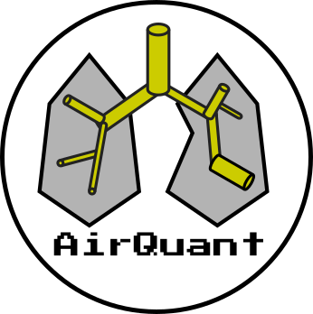

```
@misc{pakzad2021evaluation,
      title={Evaluation of automated airway morphological quantification for assessing fibrosing lung disease}, 
      author={Ashkan Pakzad and Wing Keung Cheung and Kin Quan and Nesrin Mogulkoc and Coline H. M. Van Moorsel and Brian J. Bartholmai and Hendrik W. Van Es and Alper Ezircan and Frouke Van Beek and Marcel Veltkamp and Ronald Karwoski and Tobias Peikert and Ryan D. Clay and Finbar Foley and Cassandra Braun and Recep Savas and Carole Sudre and Tom Doel and Daniel C. Alexander and Peter Wijeratne and David Hawkes and Yipeng Hu and John R Hurst and Joseph Jacob},
      year={2021},
      eprint={2111.10443},
      archivePrefix={arXiv},
      primaryClass={physics.med-ph}
}
```

AirQuant is a software tool based in MATLAB primarily for extracting airway measurements from fully segmented airways of a chest CT.

## Acknowledgments
* Based on Kin Quan "Airway Tapering In CT" [1]
* skel2graph3d-matlab by Philip Kollmannsberger [2]
* ellipse.m by David Long [3]
* linspecer.m by Jonathan C. Lansey [4]
* Tom Doel's Pulmonary Toolkit [5]

## Sample Data Acknowledgments

### chestct - "LIDC-IDRI-0066"
Source CT image is from the LIDC-IDRI:

* Armato III, S. G., McLennan, G., Bidaut, L., McNitt-Gray, M. F., Meyer, C. R., Reeves, A. P., Zhao, B., Aberle, D. R., Henschke, C. I., Hoffman, E. A., Kazerooni, E. A., MacMahon, H., Van Beek, E. J. R., Yankelevitz, D., Biancardi, A. M., Bland, P. H., Brown, M. S., Engelmann, R. M., Laderach, G. E., Max, D., Pais, R. C. , Qing, D. P. Y. , Roberts, R. Y., Smith, A. R., Starkey, A., Batra, P., Caligiuri, P., Farooqi, A., Gladish, G. W., Jude, C. M., Munden, R. F., Petkovska, I., Quint, L. E., Schwartz, L. H., Sundaram, B., Dodd, L. E., Fenimore, C., Gur, D., Petrick, N., Freymann, J., Kirby, J., Hughes, B., Casteele, A. V., Gupte, S., Sallam, M., Heath, M. D., Kuhn, M. H., Dharaiya, E., Burns, R., Fryd, D. S., Salganicoff, M., Anand, V., Shreter, U., Vastagh, S., Croft, B. Y., Clarke, L. P. (2015). Data From LIDC-IDRI [Data set]. The Cancer Imaging Archive. https://doi.org/10.7937/K9/TCIA.2015.LO9QL9SX

* Armato SG 3rd, McLennan G, Bidaut L, McNitt-Gray MF, Meyer CR, Reeves AP, Zhao B, Aberle DR, Henschke CI, Hoffman EA, Kazerooni EA, MacMahon H, Van Beeke EJ, Yankelevitz D, Biancardi AM, Bland PH, Brown MS, Engelmann RM, Laderach GE, Max D, Pais RC, Qing DP, Roberts RY, Smith AR, Starkey A, Batrah P, Caligiuri P, Farooqi A, Gladish GW, Jude CM, Munden RF, Petkovska I, Quint LE, Schwartz LH, Sundaram B, Dodd LE, Fenimore C, Gur D, Petrick N, Freymann J, Kirby J, Hughes B, Casteele AV, Gupte S, Sallamm M, Heath MD, Kuhn MH, Dharaiya E, Burns R, Fryd DS, Salganicoff M, Anand V, Shreter U, Vastagh S, Croft BY.  The Lung Image Database Consortium (LIDC) and Image Database Resource Initiative (IDRI): A completed reference database of lung nodules on CT scans. Medical Physics, 38: 915--931, 2011. DOI: https://doi.org/10.1118/1.3528204

* Clark, K., Vendt, B., Smith, K., Freymann, J., Kirby, J., Koppel, P., Moore, S., Phillips, S., Maffitt, D., Pringle, M., Tarbox, L., & Prior, F. (2013). The Cancer Imaging Archive (TCIA): Maintaining and Operating a Public Information Repository. Journal of Digital Imaging, 26(6), 1045–1057. https://doi.org/10.1007/s10278-013-9622-7

* The authors acknowledge the National Cancer Institute and the Foundation for the National Institutes of Health, and their critical role in the creation of the free publicly available LIDC/IDRI Database used in this study.

Labels are from:
* Y. Qin, Y. Gu, H. Zheng, M. Chen, J. Yang and Y. -M. Zhu, "AirwayNet-SE: A Simple-Yet-Effective Approach to Improve Airway Segmentation Using Context Scale Fusion," 2020 IEEE 17th International Symposium on Biomedical Imaging (ISBI), 2020, pp. 809-813, doi: 10.1109/ISBI45749.2020.9098537.


## References
[1] K. Quan et al., “Tapering analysis of airways with bronchiectasis,” Proc. SPIE 10574, 105742G (2018). https://arxiv.org/abs/1909.06604

[2] Kollmannsberger, Kerschnitzki et al., "The small world of osteocytes: connectomics of the lacuno-canalicular network in bone." New Journal of Physics 19:073019, 2017.

[3]  David Long (2020). ellipse.m (https://www.mathworks.com/matlabcentral/fileexchange/289-ellipse-m), MATLAB Central File Exchange. Retrieved January 21, 2020.

[4]  Jonathan C. Lansey (2020). Beautiful and distinguishable line colors + colormap (https://www.mathworks.com/matlabcentral/fileexchange/42673-beautiful-and-distinguishable-line-colors-colormap), MATLAB Central File Exchange. Retrieved July 24, 2020.

[5] Pulmonary Toolkit, Tom Doel. https://github.com/tomdoel/pulmonarytoolkit
