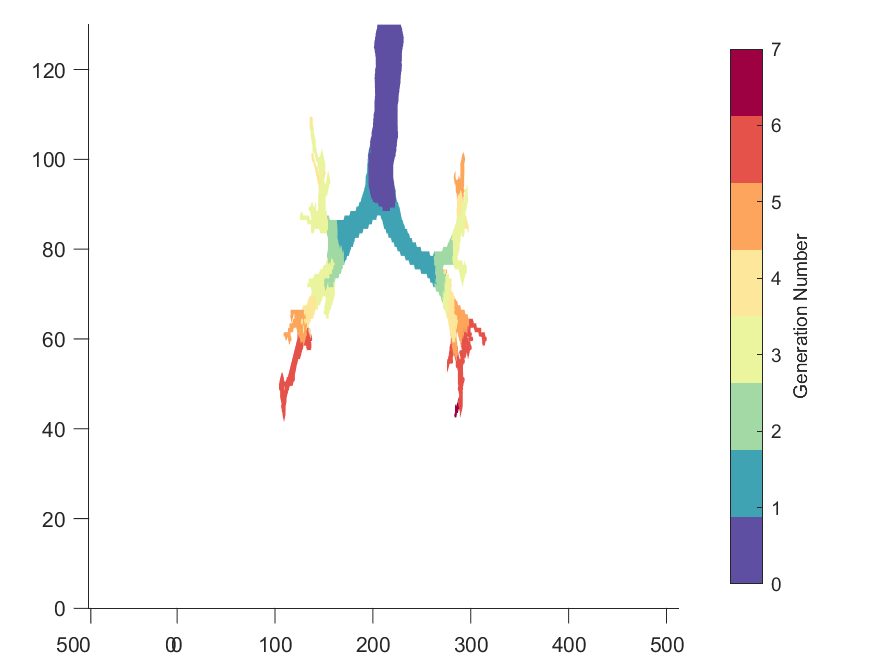
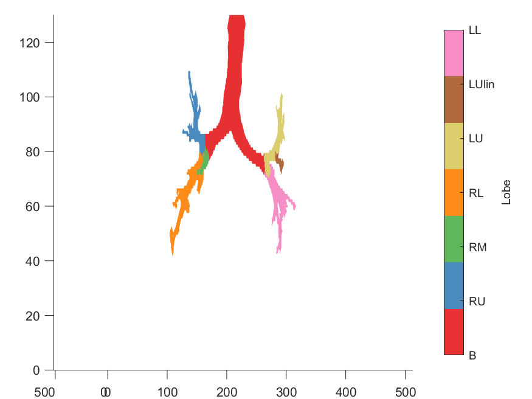
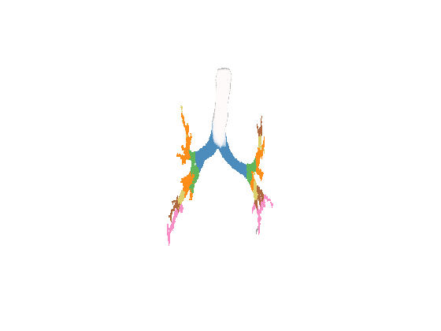
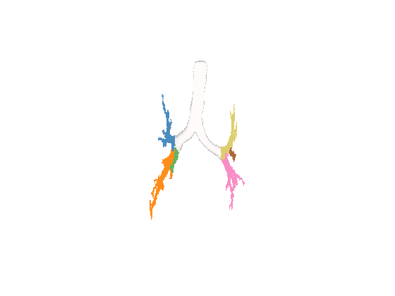
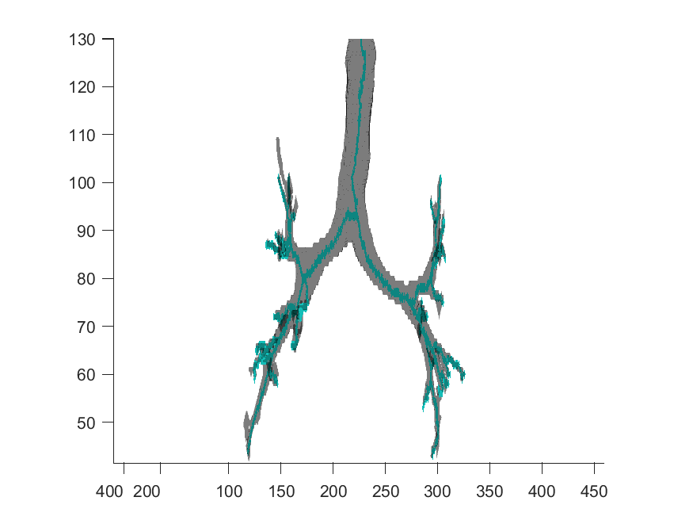
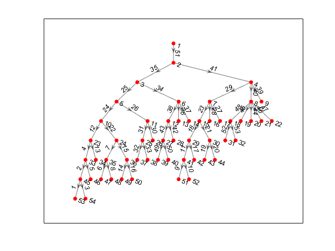
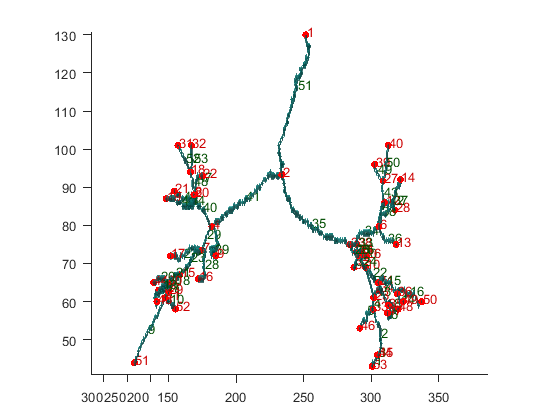
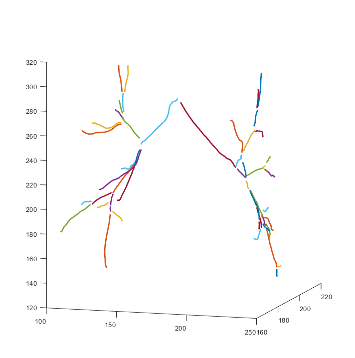
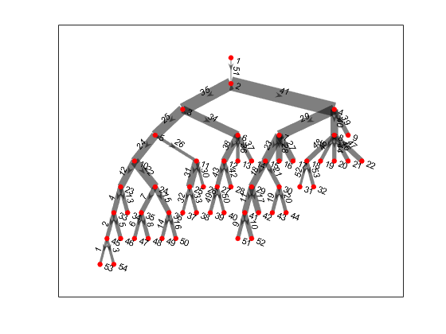

# Visualisation
AirQuant has a number of methods for visualising useful data. Often there are 3D visualisations where the airway segmentation is classified and 2D visualisations where the airway graph can be represented.

## 3D
### PlotMap3D(obj, mode)
Visualise the airway segmentation in 3D and classify by either 'lobe' or 'generation' using MATLAB's standard `isosurface` library.

*Notes*

In cases where the result may appear buggy, it is recommended that the user use `View3D`.

If the entire segmentation is not skeletonised properly i.e. the volume is not fully connected then those detached parts will most likely appear anomalous as they will be labelled by whichever lobe's airways they are physically nearest to.

*Example*
```
% after initialising object
savename = 'results/github_demo/github_demo_AQ.m'
AQ = AirQuant(savename);
% classify by generation
figure;
PlotMap3D(AQ, 'generation');
% classify by lobes
figure;
PlotMap3D(AQ, 'lobe');
```





### View3D(obj, mode)
An alternative to PlotMap3D, it uses MATLAB's VolumeViewer to visualise and label the airways by generation and lobe. Accepted modes either 'lobe' or 'generation'.

*Notes*

If possible, it is recommended that the user use `PlotMap3D` as it result in a better standard.

If the entire segmentation is not skeletonised properly i.e. the volume is not fully connected then those detached parts will most likely appear anomalous as they will be labelled by whichever lobe's airways they are physically nearest to.

*Example*
```
% after initialising object
savename = 'results/github_demo/github_demo_AQ.m'
AQ = AirQuant(savename);
% classify by generation
PlotMap3D(AQ, 'generation');
% classify by lobes
figure;
PlotMap3D(AQ, 'lobe');
```





### PlotSegSkel(obj)
plots the airway skeleton within a translucent faced segmentation. This can be useful to identify any problems with the skeleton if results appear suspicious.

*Example*
```
% after initialising object
savename = 'results/github_demo/github_demo_AQ.m'
AQ = AirQuant(savename);
% plot airways and skeleton
figure;
PlotSegSkel(AQ);
```



## Graph

### plot(obj, type)
Plot the digraph as a tree structure and specify edge label type as either 'index', 'lobes', 'generation' or 'none'. By default if the second param is not specified it will set the graph edges as the airway index number set within AirQuant.

*Example*
```
% after initialising object
savename = 'results/github_demo/github_demo_AQ.m'
AQ = AirQuant(savename);
% show digraph
figure;
plot(AQ);
```



### PlotTree(obj)
Plot the skeleton with all graph information. Airways are numbered by their index.

*Example*
```
% after initialising object
savename = 'results/github_demo/github_demo_AQ.m'
AQ = AirQuant(savename);
% show tree plot
figure;
PlotTree(AQ);
```



### PlotSplineTree(obj)
Plot all the splines that are fit to the airway skeleton. The colour of each spline is random, but useful for distinguishing.

This function requires the user to have directly or indirectly called the method `ComputeSpline` for all airways see [CT Airway Interpolation](/docs/interp.md).

*Notes*

This resultant plot may not align with other 3D objects due to the way in which spline data is stored in the AQ object at a fundamental level. This will be addressed in future releases.

*Example*
```
% after initialising object
savename = 'results/github_demo/github_demo_AQ.m'
AQ = AirQuant(savename);
% show tree plot
figure;
PlotSplineTree(AQ);
```



### GraphPlotDiameter(obj)
Plot the airway digraph where edges line thickness correspond proportionally to the average diameter of each airway.

This function requires all airway measurements to first be processed, see [CT Airway Interpolation](/docs/interp.md) and [FWHMesl method](/docs/fwhm.md).

*Example*
```
% after initialising object and measuring all airways
savename = 'results/github_demo/github_demo_AQ.m'
AQ = AirQuant(savename);
% show average diameter plot
figure;
GraphPlotDiameter(AQ);
```


