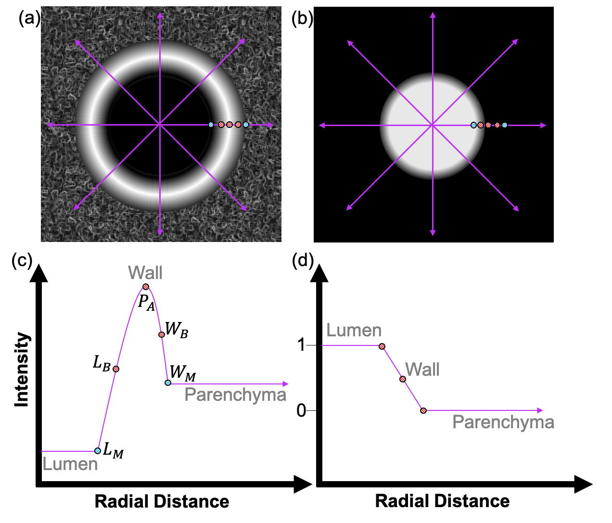

# FWHMesl method

This section will cover the methods of AirQuant that measures the airways in the interpolated airway slices by the [Full Width at Half Maximum Edge-cued Segmentation Limited method](https://doi.org/10.1117/12.595283). This is executed for the inner lumen wall edge, wall peak attenuation point and outer wall edge. It is strongly encouraged to read [K Quan et al.](https://doi.org/10.1117/12.2292306) on which this software is based. The two higher level functions are documented first, the lower level methods are mentioned to their purpose in a discussion of the theory below.

### FindFWHMall(obj)
Ultimately this whole process can be called to be executed on all airways by calling this function.

This step should only take a few minutes. You may receive some warning signs and errors in its process, these can be largely ignored unless you see it occurring for pretty much every single airway.

All results are stored in the AQ object itself. See the lower level functions that are called by this method below for more information on each step.

*Notes*

This step effectively calls `FindAirwayBoundariesFWHM` to run on every airway branch except the trachea. If the user insists on running this function of the trachea, they can call this function explicitly with the trachea index.

The interpolation parameters are automatically derived from the CT Voxel Size and stored in the AQ object properties. The user can override these parameters by setting the properties themselves after initialisation and before running this method. `num_rays` and `ray_interval`. See the Theory section for more information.

*Example*
```
% reloading processed AQ object.
savename = 'results/github_demo/github_demo_AQ.m'
AQ = AirQuant(savename);
% call function
FindFWHMall(AQ)
```

### FindAirwayBoundariesFWHM(obj, link_index)
It is rare to request the interpolation for just one airway, but this function is available if so, it is intended as a lower level method that can be called by `AirwayImageAll`. It may be useful for testing an individual case and calling some segmental visualisations.

Unlike the interpolation methods, the AQ object is not saved at the end of processing of each one as this could be significantly slow. It is recommended that the user call the `save` function themselves if they are only processing measuremnts and not computing metrics in the same session.

```
% reloading processed AQ object.
savename = 'results/github_demo/github_demo_AQ.m'
AQ = AirQuant(savename);
% call function
FindAirwayBoundariesFWHM(AQ, 41)
```


# Theory
There are 3 listed steps to this process. The first two involve numerous loops of code but are very fast.

* Raycasting from centre outwards.
* Identifying stop points.
* Ellipse fitting.

The FWHMesl method in essence treats the 1D intesity profile across the wall as a bell shaped peak from which the inner edge is idenitified by the left [FWHM](https://en.wikipedia.org/wiki/Full_width_at_half_maximum) and the outer edge by the right FWHM. However, this profile can be noisy and is therefore made more robust by using information from the interpolated segmentation where the wall is expected to be near the edge of the segmentation. Note that the interpolated segmentation is no longer binary but is now continuous between [0, 1]. This figure illustrates how the method works to supplement the text.


*(a) Interpolated CT showing showing raycast lines from centre where the 1D profile is captured. (b) the equivalent interpolated segmentation. (c) the 1D intensity of the CT showing the bell shape. (d) the 1D intensity of the segmentation along the same cast ray in the CT. L_B and  W_B mark the lumen and wall boundary respectively. P_A marks the wall peak, also known as the peak attenuation point.*


## Raycasting and stop points.
The centre of the airway is identified by `Return_centre_pt_image` and confirmed by the segmentation too `Check_centre_with_segmentation`.

The rays are then cast by `Raycast` from this point outwards to get then 1D intensity profiles outwards from this point. The radial ray sampling is set by `obj.ray_interval` (0.2 degrees by default).

The FWHM method is executed on each individual pair of ray 1D intensity profiles by `AirQuant.computeFWHM`. This identifies the stop points for each of the inner wall, wall peak-attenuation and outer wall. The FWHMesl method identifies the peak closest to the segmentation image edge. The peak is then travelled downwards along the negative gradient until it plateaus on both sides; it computes the mid point between these trough points and the peak to get the width at half maximum. Hence the name.

Finally for each set of raycast stop points an ellipse is fit by `ComputeEllipses` in 2D. The results are saved in the private property `obj.FWHMesl`.
