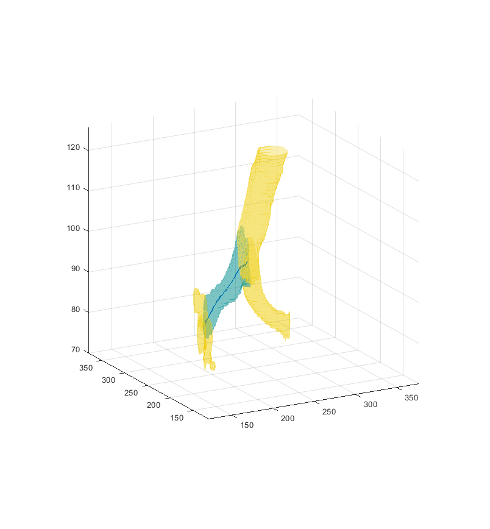
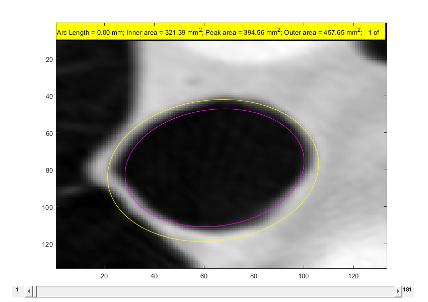
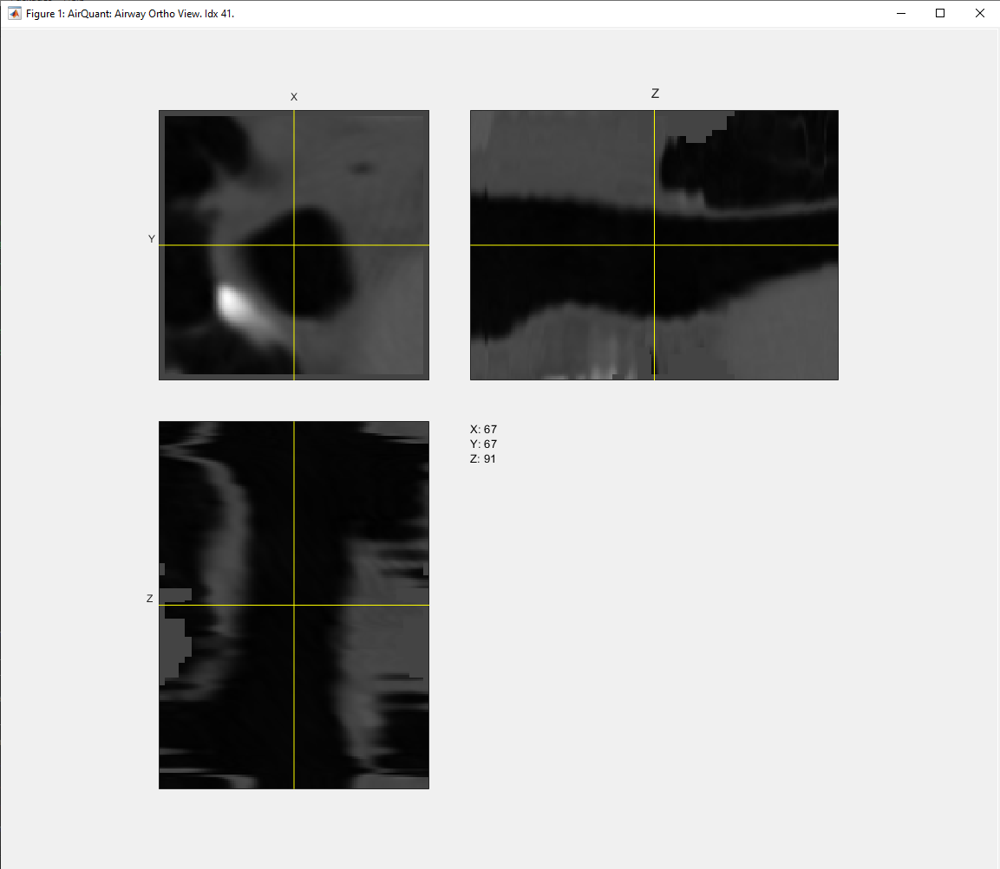

# Segmental Visualisation

These visualisation methods are intended for individual airway branches, hence the input argument `link_index`. Specify which branch to investigate by setting this value, it can be useful to see which airway corresponds to which by looking at the digraph first with `plot(AQ)`.

### h = PlotSplineVecs(obj, subsamp, link_index)
Plot the normal vectors along the spline points of a particular airway branch.
The current branch will appear in blue and neighboring airways in yellow for context.

`link_index` can be an individual airway or multiple provided in a single array. It will not be as detailed with a single airway if multiple are provided. If left blank, it will plot the splines of all airways which may take a while.

One can provide a `subsamp` value to indicate how often to sample the spline points. e.g. greater the number, the fewer sampled vectors will be shown.

This function requires the user to have directly or indirectly called the method `ComputeSpline` for all airways see  [CT Airway Interpolation](/docs/interp.md).

*Notes*

It may become easier to interpret the resultant plot by increasing the `subsamp` value.

Caution: This method has not been robustly tested.

*Example*
```
% reloading processed AQ object.
savename = 'results/github_demo/github_demo_AQ.m'
AQ = AirQuant(savename);
% call function
figure;
h = PlotSplineVecs(AQ, 2, 41)
```



### PlotAirway3(obj, link_index)
Interactively scroll through the interpolated airway slices of a particular branch. The computed inner and outer airway wall edge are overlaid on top with further information shown at the top in the yellow bar. In slices where measurements failed, no overlay is shown.

This function requires airway measurements of `link_index` to first be processed, see [CT Airway Interpolation](/docs/interp.md) and [FWHMesl method](/docs/fwhm.md).

*Example*
```
% reloading processed AQ object.
savename = 'results/github_demo/github_demo_AQ.m'
AQ = AirQuant(savename);
% call function
PlotAirway3(AQ, 41)
```



### s = OrthoViewAirway(obj, link_index)
Interactively view the interpolated airway slices of a particular branch.

Uses MATLAB's built in orthosliceViewer. `s` the output is the slice viewer object see `help orthosliceViewer` for more information about it.

This function requires airway measurements of `link_index` to first be processed, see [CT Airway Interpolation](/docs/interp.md) and [FWHMesl method](/docs/fwhm.md).

*Example*
```
% reloading processed AQ object.
savename = 'results/github_demo/github_demo_AQ.m'
AQ = AirQuant(savename);
% call function
s = OrthoViewAirway(AQ, 41)
```


